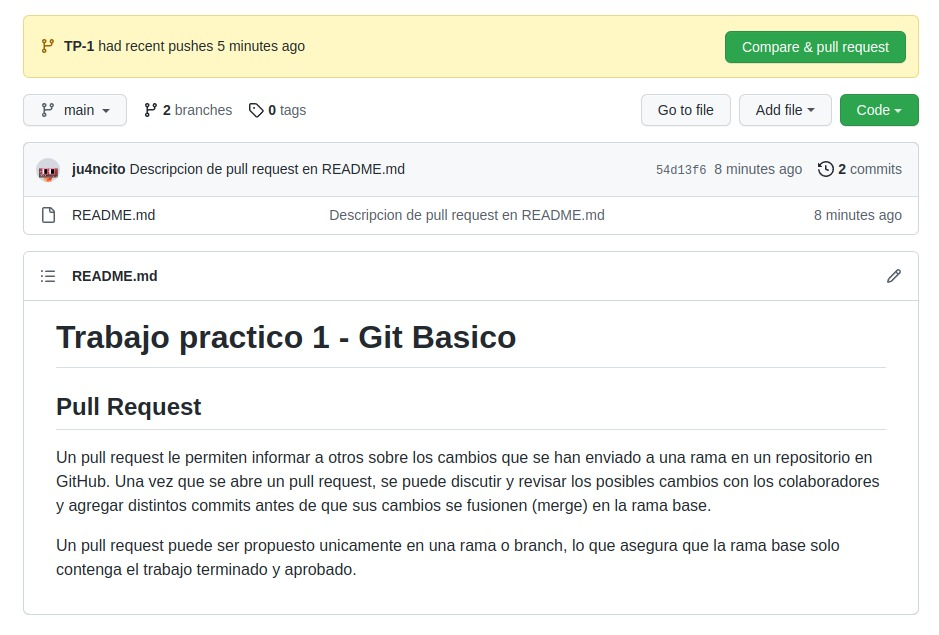
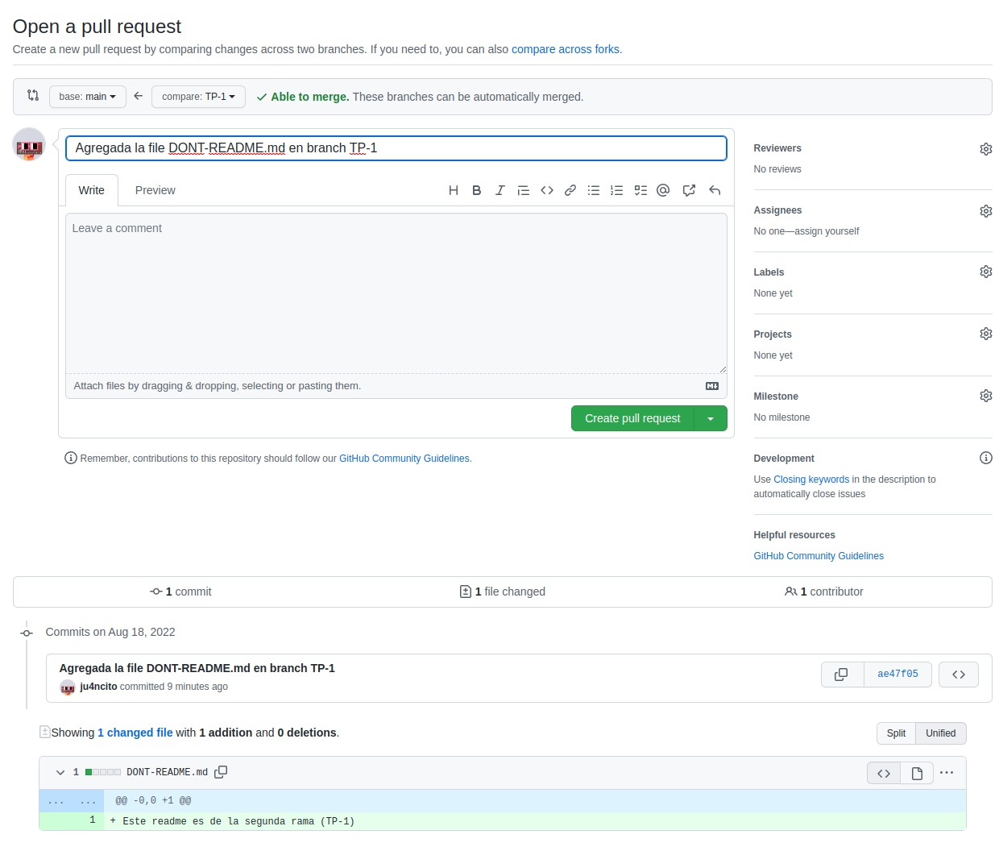
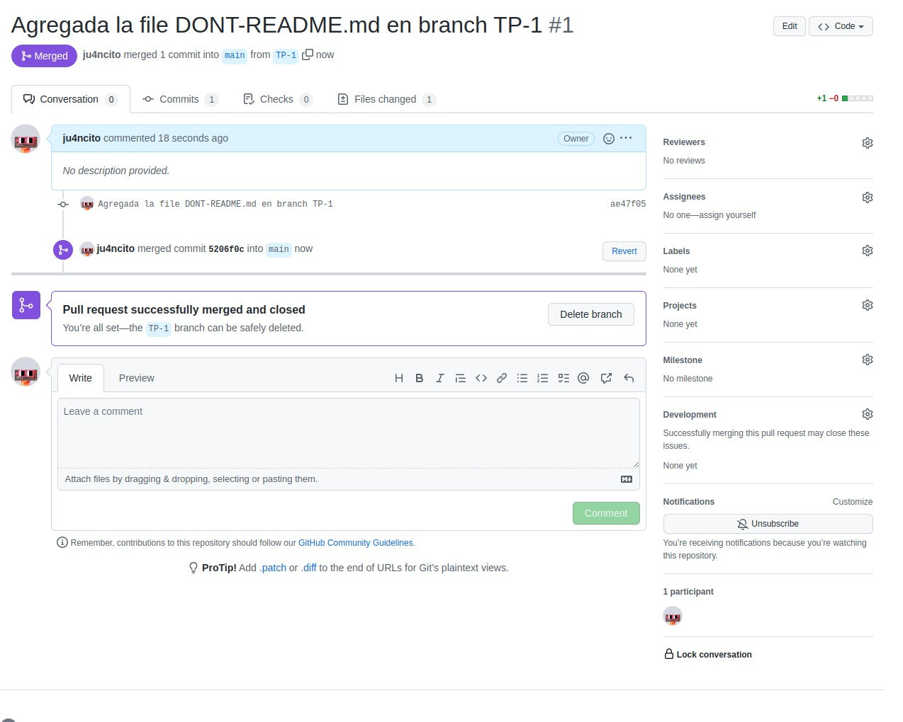
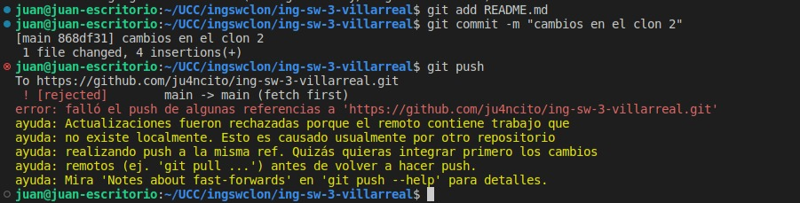
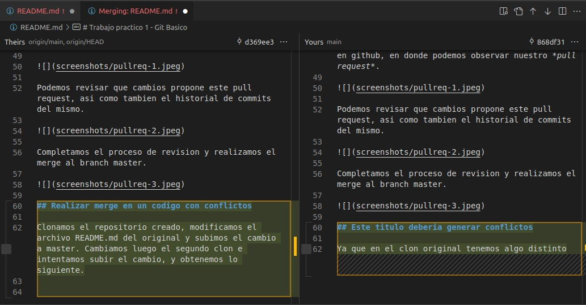
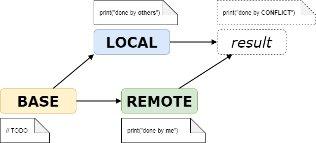

# Trabajo practico 1 - Git Basico

## Pull Request

Un *pull request* permite informar a otros sobre los cambios que se han enviado a una rama en un repositorio en GitHub. Una vez que se abre un *pull request*, se puede discutir y revisar los posibles cambios con los colaboradores y agregar distintos commits antes de que sus cambios se fusionen (merge) en la rama base.

Un *pull request* puede ser propuesto unicamente en una rama o branch, lo que asegura que la rama base solo contenga el trabajo terminado y aprobado. Es muy utilizado al momento de contribuir a proyectos *open source*. 

### Ejemplo practico

En primer lugar, creamos una nueva branch, y un nuevo archivo llamado DONT-README. Realizamos el commit y lo pusheamos a su respectiva rama.


```
juan@juan-escritorio:~/UCC/ing-sw-3$ git branch TP-1
juan@juan-escritorio:~/UCC/ing-sw-3$ git branch
  TP-1
* main
juan@juan-escritorio:~/UCC/ing-sw-3$ git switch TP-1
Cambiado a rama 'TP-1'
juan@juan-escritorio:~/UCC/ing-sw-3$ touch DONT-README.md
juan@juan-escritorio:~/UCC/ing-sw-3$ nano DONT-README.md 
juan@juan-escritorio:~/UCC/ing-sw-3$ git add DONT-README.md 
juan@juan-escritorio:~/UCC/ing-sw-3$ git commit -m "Agregada la file DONT-README.md en branch TP-1"
[TP-1 ae47f05] Agregada la file DONT-README.md en branch TP-1
 1 file changed, 1 insertion(+)
 create mode 100644 DONT-README.md


juan@juan-escritorio:~/UCC/ing-sw-3$ git push --set-upstream origin TP-1
Enumerando objetos: 4, listo.
Contando objetos: 100% (4/4), listo.
Compresión delta usando hasta 8 hilos
Comprimiendo objetos: 100% (2/2), listo.
Escribiendo objetos: 100% (3/3), 348 bytes | 348.00 KiB/s, listo.
Total 3 (delta 0), reusados 0 (delta 0), pack-reusados 0
remote: 
remote: Create a pull request for 'TP-1' on GitHub by visiting:
remote:      https://github.com/ju4ncito/ing-sw-3-villarreal/pull/new/TP-1
remote: 
To https://github.com/ju4ncito/ing-sw-3-villarreal.git
 * [new branch]      TP-1 -> TP-1
Rama 'TP-1' configurada para hacer seguimiento a la rama remota 'TP-1' de 'origin'.


```

Ahora nos dirigimos a nuestro repositorio remoto en github, en donde podemos observar nuestro *pull request*.



Podemos revisar que cambios propone este pull request, asi como tambien el historial de commits del mismo.



Completamos el proceso de revision y realizamos el merge al branch master.



## Realizar merge en un codigo con conflictos

Clonamos el repositorio creado, modificamos el archivo README.md del original y subimos el cambio a master. 

```
juan@juan-escritorio:~/UCC/ing-sw-3$ git commit -m "Cambios del clon original"
[main d369ee3] Cambios del clon original
 1 file changed, 5 insertions(+)
juan@juan-escritorio:~/UCC/ing-sw-3$ git push
Enumerando objetos: 5, listo.
Contando objetos: 100% (5/5), listo.
Compresión delta usando hasta 8 hilos
Comprimiendo objetos: 100% (3/3), listo.
Escribiendo objetos: 100% (3/3), 519 bytes | 519.00 KiB/s, listo.
Total 3 (delta 1), reusados 0 (delta 0), pack-reusados 0
remote: Resolving deltas: 100% (1/1), completed with 1 local object.
To https://github.com/ju4ncito/ing-sw-3-villarreal.git
   9a80326..d369ee3  main -> main
```

Cambiamos luego el segundo clon e intentamos subir el cambio, y obtenemos lo siguiente.



La herramienta de comparacion nos muestra el error.



## Comparacion entre **LOCAL**, **BASE** y **REMOTE**

Git realiza lo que llamamos una "fusion de tres vias" cuando requerimos un git merge.

*LOCAL* refiere a los cambios que realizamos nosotros (repo local)

*REMOTE* refiere a los cambios que han sido subidos al repositorio remoto, en donde residen generalmente los cambios hechos por otros usuarios

*BASE* es la version de los archivos en donde ambas versiones tienen el ancestro comun mas cercano. A partir de este se analizan ambos cambios producidos por las otras dos versiones, y luego se obtiene el resultado.


