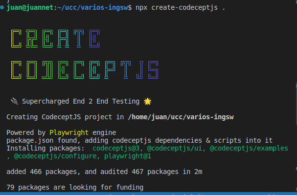

# Trabajo practico 10

## Pruebas de integracion

Una prueba de integración tiene como objetivo probar el comportamiento de un componente o la integración entre un conjunto de componentes. El término prueba funcional se usa a veces como sinónimo para prueba de integración. Las pruebas de integración comprueban que todo el sistema funciona según lo previsto, por lo que reducen la necesidad de pruebas manuales intensivas.

Este tipo de pruebas le permiten traducir sus historias de usuario en un conjunto de pruebas. La prueba se asemejaría a una interacción esperada del usuario con la aplicación.

### Familiarizarse con CodeceptJs

CodeceptJS es un marco de prueba moderno de extremo a extremo con una sintaxis especial de estilo BDD. Las pruebas se escriben como un escenario lineal de la acción del usuario en un sitio.

Ejemplo:

```
Feature('CodeceptJS demo');

Scenario('check Welcome page on site', ({ I }) => {
  I.amOnPage('/');
  I.see('Welcome');
});
```

Cada prueba se describe dentro de un `Scenario` function con el `I` object que se le pasa. El `I` object es un actor, una abstracción para un usuario de prueba. El `I` object es un objeto de proxy para los ayudantes habilitados actualmente.

### Test de pagina de GitHub

```
npx create-codeceptjs .
```



```
npx codeceptjs init
```

Configurado el entorno modificamos el test `github_test.ts` y colocamos

```
Scenario('test something', (I) => {
  I.amOnPage('https://github.com');
  I.see('GitHub');
});
```

Corremos, se abre un navegador con github y pasa el test!

```
juan@juannet:~/ucc/ing-tp10$ npx codeceptjs run --steps
context
CodeceptJS v3.3.6 #StandWithUkraine
Using test root "/home/juan/ucc/ing-tp10"

github --
  test something
    I am on page "https://github.com"
    I see "GitHub"
  ✔ OK in 2375ms


  OK  | 1 passed   // 3s
```

Ahora agregamos mas validaciones

```
Feature('github');

Scenario('test something', ({ I }) => {
    I.amOnPage('https://github.com');
    I.see('GitHub');
    I.see('The home for all developers');
    I.scrollPageToBottom();
    I.seeElement("//li[contains(.,'© 2022 GitHub, Inc.')]");
});

```

Corremos el test

```
juan@juannet:~/ucc/ing-tp10$ npx codeceptjs run --steps
context
CodeceptJS v3.3.6 #StandWithUkraine
Using test root "/home/juan/ucc/ing-tp10"

github --
  test something
    I am on page "https://github.com"
    I see "GitHub"
    I see "The home for all developers"
    I scroll page to bottom
    I see element "//li[contains(.,'© 2022 GitHub, Inc.')]"
  ✔ OK in 1514ms


  OK  | 1 passed   // 2s
```

### Testeando en aplicacion spring-boot

Vamos a nuestra aplicacion spring-boot y luego de modificar nuestro `spring-boot_test.js` y `codecept.conf.js` levantamos spring-boot

```
java -jar target/spring-boot-sample-actuator-2.0.2.jar

2022-10-18 19:48:48.678  INFO 39045 --- [           main] s.actuator.SampleActuatorApplication     : Started SampleActuatorApplication in 3.728 seconds (JVM running for 4.275)

```

Y ejecutamos los tests desde la carpeta

```
juan@juannet:~/ucc/springboot-tp10$ npx codeceptjs run --steps
CodeceptJS v3.3.6 #StandWithUkraine
Using test root "/home/juan/ucc/springboot-tp10"

spring-boot --
  Verify a successful call
    I send get request "/"
  ✔ OK in 21ms

  Verify return value
    I send get request "/"
  ✔ OK in 7ms
```

### Habilitar reportes para utilizarlos en CICD

Luego de instalar el modulo y agregar la key mocha, ejecutamos los tests

```
juan@juannet:~/ucc/springboot-tp10$ npx codeceptjs run --steps --reporter mocha-multiCodeceptJS v3.3.6 #StandWithUkraine
Using test root "/home/juan/ucc/springboot-tp10"

spring-boot --
  Verify a successful call
    I send get request "/"
  ✔ OK in 41ms

  Verify return value
    I send get request "/"
  ✔ OK in 9ms


  OK  | 2 passed   // 60ms
```

La salida en `./output/results.xml` es la siguiente

```
<?xml version="1.0" encoding="UTF-8"?>
<testsuites name="Mocha Tests" time="0.060" tests="2" failures="0">
  <testsuite name="Root Suite" timestamp="2022-10-18T22:59:26" tests="0" time="0.000" failures="0">
  </testsuite>
  <testsuite name="spring-boot" timestamp="2022-10-18T22:59:26" tests="2" file="/home/juan/ucc/springboot-tp10/spring-boot_test.js" time="0.058" failures="0">
    <testcase name="spring-boot: Verify a successful call" time="0.041" classname="Verify a successful call">
    </testcase>
    <testcase name="spring-boot: Verify return value" time="0.009" classname="Verify return value">
    </testcase>
  </testsuite>
</testsuites>
```

### Integrar la ejecucion en Jenkins
