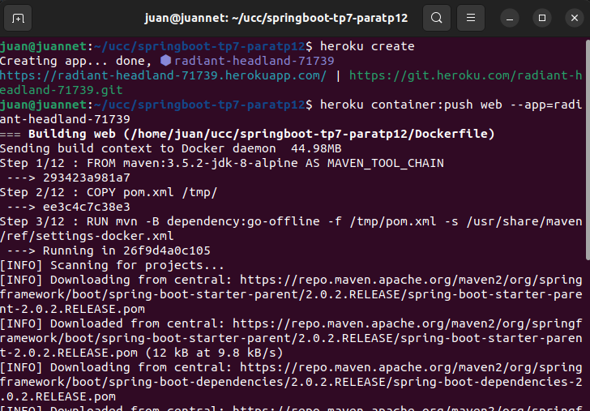

# Trabajo practico 12

## Heroku

Creamos cuenta en Heroku y logeamos

```
heroku login
heroku container:login
```

Modificamos nuestro archivo dockerfile

```
FROM maven:3.5.2-jdk-8-alpine AS MAVEN_TOOL_CHAIN
COPY pom.xml /tmp/
RUN mvn -B dependency:go-offline -f /tmp/pom.xml -s /usr/share/maven/ref/settings-docker.xml
COPY src /tmp/src/
WORKDIR /tmp/
RUN mvn -B -s /usr/share/maven/ref/settings-docker.xml package

FROM openjdk:8-jre-alpine

ENV PORT=8080

EXPOSE 8080

RUN mkdir /app
COPY --from=MAVEN_TOOL_CHAIN /tmp/target/*.jar /app/spring-boot-application.jar

# ENV JAVA_OPTS="-Xms32m -Xmx128m"

CMD ["java", "-Xms32m", "-Xmx128m", "-jar", "-Dserver.port=${PORT}", "-Djava.security.egd=file:/dev/./urandom", "/app/spring-boot-application.jar"]
```

Creamos la aplicacion

```
juan@juannet:~/ucc/springboot-tp7-paratp12$ heroku create
Creating app... done, ⬢ radiant-headland-71739
https://radiant-headland-71739.herokuapp.com/ | https://git.heroku.com/radiant-headland-71739.git
```



Generamos y subimos la Imagen de Docker al registry de Heroku

```
juan@juannet:~/ucc/springboot-tp7-paratp12$ heroku container:push web --app=radiant-headland-71739
=== Building web (/home/juan/ucc/springboot-tp7-paratp12/Dockerfile)
Sending build context to Docker daemon  44.98MB


...


=== Pushing web (/home/juan/ucc/springboot-tp7-paratp12/Dockerfile)
Using default tag: latest
The push refers to repository [registry.heroku.com/radiant-headland-71739/web]
be143c66a3db: Pushed
18e485ec688b: Pushed
edd61588d126: Pushed
9b9b7f3d56a0: Pushed
f1b5933fe4b5: Pushed
latest: digest: sha256:05f97077bc937a2045866b8242080dd92795880233d887c3e0f2f3bb59aa7c01 size: 1365
Your image has been successfully pushed. You can now release it with the 'container:release' command.
```

Terminada la operacion, desplegamos la aplicacion

```
juan@juannet:~/ucc/springboot-tp7-paratp12$ heroku container:release web --app=radiant-headland-71739
Releasing images web to radiant-headland-71739... done
```

Testeamos

```
juan@juannet:~/ucc/springboot-tp7-paratp12$  curl https://radiant-headland-71739.herokuapp.com
{"message":"Holas Holas"}
```
