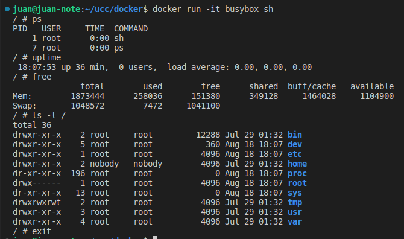
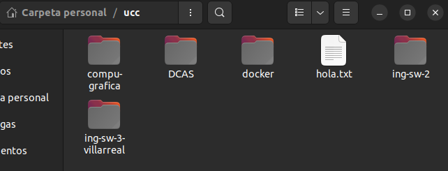
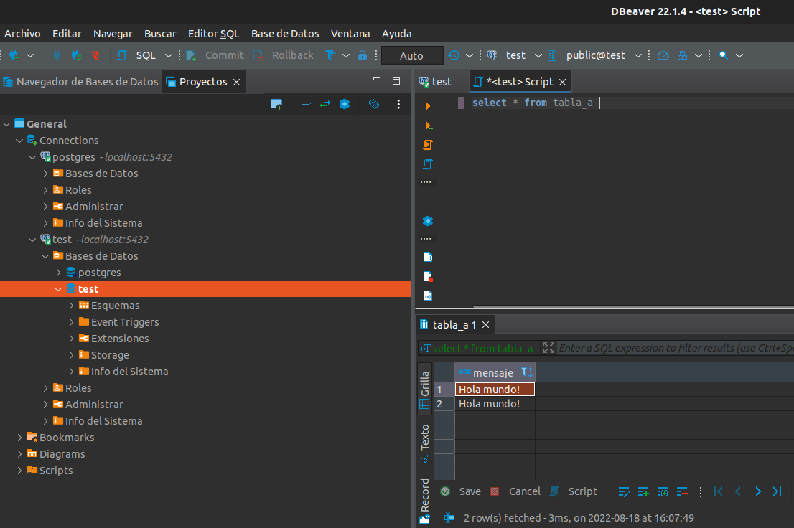

# Trabajo practico 2 - Introduccion a Docker

## Desarrollo

Una vez instalamos Docker y nos registramos en DockerHub, obtenemos la imagen de BusyBox con el comando correspondiente.

```
juan@juan-note:~/ucc/docker$ docker pull busybox
Using default tag: latest
latest: Pulling from library/busybox
50783e0dfb64: Pull complete 
Digest: sha256:ef320ff10026a50cf5f0213d35537ce0041ac1d96e9b7800bafd8bc9eff6c693
Status: Downloaded newer image for busybox:latest
docker.io/library/busybox:latest
```
Comprobamos version y tamano de la imagen bajada, listando las imagenes actuales

```
juan@juan-note:~/ucc/docker$ docker images
REPOSITORY   TAG       IMAGE ID       CREATED       SIZE
busybox      latest    7a80323521cc   2 weeks ago   1.24MB
```

Al ejecutar busybox sin ninguna otra instruccion, la imagen deja de correr ya que no posee una instruccion que le indique que deba continuar en ejecucion.

Ejecutamos ahora si busybox pero con un comando a correr

```
juan@juan-note:~/ucc/docker$ docker run busybox echo "Hola Mundo"
Hola Mundo
```

Con el comando docker ps vemos las imagenes activas, mientras que con -a vemos el historial se imagenes con sus comandos y tiempos de estado

```
juan@juan-note:~/ucc/docker$ docker ps
CONTAINER ID   IMAGE     COMMAND   CREATED   STATUS    PORTS     NAMES
juan@juan-note:~/ucc/docker$ docker ps -a
CONTAINER ID   IMAGE     COMMAND               CREATED         STATUS                     PORTS     NAMES
0e388d0b4442   busybox   "echo 'Hola Mundo'"   2 minutes ago   Exited (0) 2 minutes ago             trusting_dhawan
5020b71f203a   busybox   "sh"                  6 minutes ago   Exited (0) 6 minutes ago             vigorous_babbage
```
### Ejecutando en modo interactivo

Enviamos una serie de comandos dentro del contenedor, que lo ejecutamos con el comando *sh*



### Borrando contenedores terminados

Utilizamos el ID o el nombre autogenerado del contenedor para borrarlo. Podemos tambien borrar todos los contenedores que no esten corriendo.

### Montando volumenes

Para montar un volumen dentro del contenedor ejecutamos los siguientes comandos

```
juan@juan-note:~$ docker run -it -v /home/juan/ucc:/var/escritorio busybox /bin/sh
/ # ls -l /var/escritorio
total 20
drwxrwxr-x    3 root     root          4096 Mar 17 15:37 DCAS
drwxrwxr-x    4 root     root          4096 Apr  8 17:15 compu-grafica
drwxrwxr-x    2 root     root          4096 Aug 18 17:50 docker
drwxrwxr-x    2 root     root          4096 Aug 18 17:32 ing-sw-2
drwxrwxr-x    5 root     root          4096 Aug 18 17:37 ing-sw-3-villarreal
/ # touch /var/escritorio/hola.txt
/ # ls -l /var/escritorio
total 20
drwxrwxr-x    3 root     root          4096 Mar 17 15:37 DCAS
drwxrwxr-x    4 root     root          4096 Apr  8 17:15 compu-grafica
drwxrwxr-x    2 root     root          4096 Aug 18 17:50 docker
-rw-r--r--    1 root     root             0 Aug 18 18:28 hola.txt
drwxrwxr-x    2 root     root          4096 Aug 18 17:32 ing-sw-2
drwxrwxr-x    5 root     root          4096 Aug 18 17:37 ing-sw-3-villarreal
/ # exit
```

Obtenemos nuestro archivo en el directorio de nuestra PC, por lo que el volumen fue montado correctamente.



### Publicando puertos

Ejecutamos la siguiente imagen con la bandera DETACH. Como no tenemos la imagen se descarga automaticamente. 

Inicialmente, si lo instalamos con 

```
docker run -d daviey/nyan-cat-web
```

No estamos exponiendo ningun puerto de nuestra PC, por lo que necesitamos exponer el puerto 80 en este caso para conectarnos a traves de localhost. Corremos entonces

```
docker run -d -p 80:80 daviey/nyan-cat-web
```


### Utilizando una base de datos

Levantamos un PostgreSQL

```
docker run --name my-postgres -e POSTGRES_PASSWORD=mysecretpassword -v $HOME/.postgres:/var/lib/postgresql/data -p 5432:5432 -d postgres:9.4
```
Conectamos con la base

```
juan@juan-note:~$ ^C
juan@juan-note:~$ docker exec -it my-postgres /bin/bash
root@be4ed2294379:/# psql -h localhost -U postgres
psql (9.4.26)
Type "help" for help.

postgres=# 
```

Tiramos una serie de comandos, que crean una nueva base de datos, conectan con ella y crean una tabla. Colocamos el valor Hola Mundo y realizamos la query.

```
postgres=# \l
e tabla_a (mensaje varchar(50));
insert into tabla                                 List of databases
   Name    |  Owner   | Encoding |  Collate   |   Ctype    |   Access privileges   
-----------+----------+----------+------------+------------+-----------------------
 postgres  | postgres | UTF8     | en_US.utf8 | en_US.utf8 | 
 template0 | postgres | UTF8     | en_US.utf8 | en_US.utf8 | =c/postgres          +
           |          |          |            |            | postgres=CTc/postgres
 template1 | postgres | UTF8     | en_US.utf8 | en_US.utf8 | =c/postgres          +
           |          |          |            |            | postgres=CTc/postgres
(3 rows)

postgres=# create database test;
_a (mensaje) values('Hola mundo!');
select * from tabla_a;
\qCREATE DATABASE
postgres=# \connect test
You are now connected to database "test" as user "postgres".
test=# create table tabla_a (mensaje varchar(50));
CREATE TABLE
test=# insert into tabla_a (mensaje) values('Hola mundo!');
INSERT 0 1
test=# select * from tabla_a;
   mensaje   
-------------
 Hola mundo!
(1 row)

test=# \q
root@be4ed2294379:/# exit
```

El comando *docker run* instala la imagen de PostgreSQL con la configuracion indicada en el mismo comando, mientras que *docker exec* corre el comando bash en esa imagen para luego conectar con Postgres. Utilizamos DBeaver para verificar nuestra base de datos y conectarnos con la misma. Todo OK!




