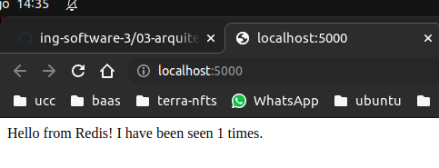
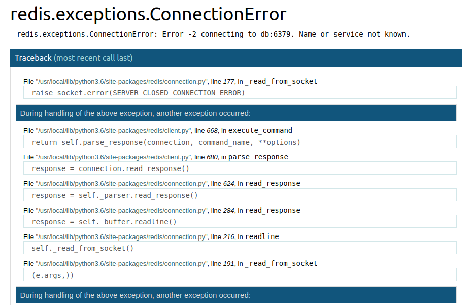
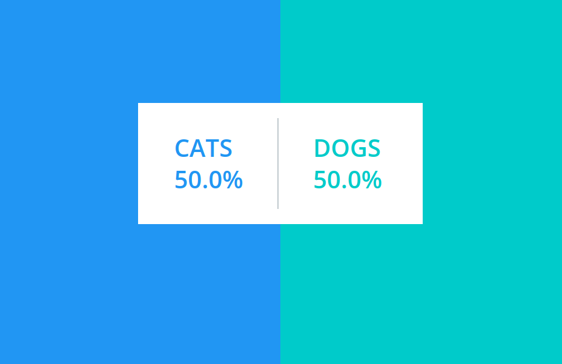
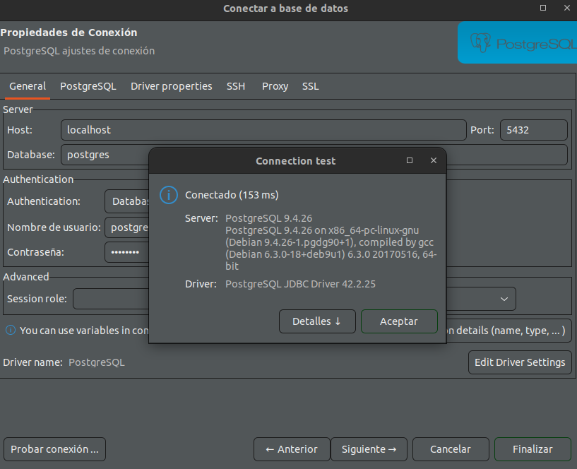
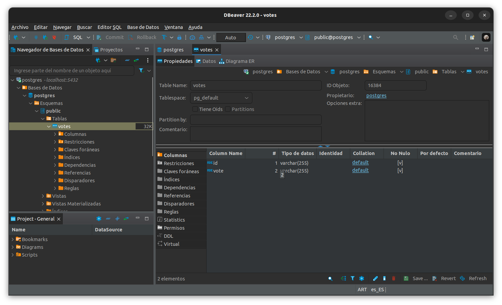

# Trabajo practico 3 - Arquitectura de Sistemas Distribuidos

## Desarrollo

Una vez tenemos Docker funcionando, comenzamos a armar nuestro pequenio sistema distribuido simple. Luego iniciamos una base de datos REDIS y una aplicacion web que la utilice.

### Sistema distribuido simple

```
docker network create -d bridge mybridge

docker run -d --net mybridge --name db redis:alpine

docker run -d --net mybridge -e REDIS_HOST=db -e REDIS_PORT=6379 -p 5000:5000 --name web alexisfr/flask-app:latest
```

Accedemos a http://localhost:5000/ 



Tenemos los puertos 5000 y 6379, cada uno correspondiente a una imagen. El puerto 5000 es el que esta abierto. 

```
juan@juan-note:~/ucc/ing-sw-3-villarreal$ docker ps
CONTAINER ID   IMAGE                       COMMAND                  CREATED          STATUS          PORTS                    NAMES
efe24e96e352   alexisfr/flask-app:latest   "python /app.py"         4 minutes ago    Up 4 minutes    0.0.0.0:5000->5000/tcp   web
d81a8b77bf8d   redis:alpine                "docker-entrypoint.s…"   10 minutes ago   Up 10 minutes   6379/tcp                 db
```

Obtenemos los detalles de la red 'mybridge'

```
juan@juan-note:~/ucc/ing-sw-3-villarreal$ docker network inspect mybridge
[
    {
        "Name": "mybridge",
        "Id": "b35421b43fd822c0f364fb1b201403b4cc6436c4dfc25a4e77dcd462a6d2e84d",
        "Created": "2022-08-25T17:25:59.701328224Z",
        "Scope": "local",
        "Driver": "bridge",
        "EnableIPv6": false,
        "IPAM": {
            "Driver": "default",
            "Options": {},
            "Config": [
                {
                    "Subnet": "172.18.0.0/16",
                    "Gateway": "172.18.0.1"
                }
            ]
        },
        "Internal": false,
        "Attachable": false,
        "Ingress": false,
        "ConfigFrom": {
            "Network": ""
        },
        "ConfigOnly": false,
        "Containers": {
            "d81a8b77bf8d5f519b89483fa76acddf914cebcc5b304c49fc2441deb578a796": {
                "Name": "db",
                "EndpointID": "a0ebba53ee22dc56b9f0daa3798f44810369cb37b8a7f177e76bef77c33ee7d3",
                "MacAddress": "02:42:ac:12:00:02",
                "IPv4Address": "172.18.0.2/16",
                "IPv6Address": ""
            },
            "efe24e96e3522873c36115948246c926830752a5be26af84e83e28759e787851": {
                "Name": "web",
                "EndpointID": "af1a4a0d24e6483fca408b3a4c1201097bbd91787412635f4b9c443d51db8ea0",
                "MacAddress": "02:42:ac:12:00:03",
                "IPv4Address": "172.18.0.3/16",
                "IPv6Address": ""
            }
        },
        "Options": {},
        "Labels": {}
    }
]
```
### Analisis

El sistema carga la base de datos con las variables que se indican 

```
Redis(host=os.environ['REDIS_HOST'], port=os.environ['REDIS_PORT'])
```

y luego incrementa la cantidad de hits a medida que routeamos a la pagina '/'.

La variable -e en el comando crea/modifica las variables de entorno para ese contenedor. Definimos el host y el puerto.

Ejecutamos ```docker rm -f web``` y corremos ```docker run -d --net mybridge -e REDIS_HOST=db -e REDIS_PORT=6379 -p 5000:5000 --name web alexisfr/flask-app:latest```

Borra el contenedor de la aplicacion web y lo vuelve a instalar. La base de datos no se ve modificada.

Ejecutamos ```docker rm -f db```



La web no se puede conectar a la base de datos. Si la levantamos de nuevo con ```docker run -d --net mybridge --name db redis:alpine``` perdemos la cuenta de las visitas

Para no perderlo deberiamos guardar esa informacion posiblemente en la nube.

### Docker compose

Luego de configurar nuestro archivo ```docker-compose.yaml``` vemos como docker compose nos ayuda a montar los contenedores necesarios, con sus dependencias, variables de entorno y puertos.

```
juan@juan-note:~/ucc/docker$ docker-compose down
Stopping docker_app_1 ... done
Stopping docker_db_1  ... done
Removing docker_app_1 ... done
Removing docker_db_1  ... done
Removing network docker_default

```

### Analisis de otro sistema distribuido

Clonamos el repo y ejecutamos 

```
docker-compose -f docker-compose-javaworker.yml up -d
```
Abrimos dos navegadores en localhost:5000 y vemos el resultado en localhost:5001



Para saber como se logro todo esto, observamos en primer lugar la arquitectura del sistema distribuido:


En el README.md del proyecto vemos parte por parte que se utilizo

* A front-end web app in [Python](/vote) or [ASP.NET Core](/vote/dotnet) which lets you vote between two options
* A [Redis](https://hub.docker.com/_/redis/) or [NATS](https://hub.docker.com/_/nats/) queue which collects new votes
* A [.NET Core](/worker/src/Worker), [Java](/worker/src/main) or [.NET Core 2.1](/worker/dotnet) worker which consumes votes and stores them in…
* A [Postgres](https://hub.docker.com/_/postgres/) or [TiDB](https://hub.docker.com/r/dockersamples/tidb/tags/) database backed by a Docker volume
* A [Node.js](/result) or [ASP.NET Core SignalR](/result/dotnet) webapp which shows the results of the voting in real time

Analizando el docker-compose.yml del repositorio, vemos que:

- La aplicacion para votar se encuentra conectada a las redes front y back, depende del contenedor _redis_ y su buen funcionamiento y escucha el puerto 5000

- La aplicacion para guardar los resultados se encuentra conectada a las redes front y back, depende del contenedor _db_ y su buen funcionamiento y escucha el puerto 5001

- La aplicacion ```worker``` se encuentra conectada unicamente a la red back, y depende tanto de _redis_ como _db_

- La aplicacion ```redis``` se encuentra conectada unicamente a la red back, se indica su imagen y sus healthckecks y escucha el puerto 6379

- La aplicacion ```db``` se encuentra conectada unicamente a la red back, se indica su imagen (postgres) y sus healthckecks.

Por lo tanto, tenemos 1 db y 2 redes.

### Analisis detallado

Modificamos el ```javaworker``` y los puertos para poder utilizar el dbeaver.

- db PostgreSQL en puerto 5432





- codigo de Python en ```(example-voting-app\vote\app.py)```

```
from flask import Flask, render_template, request, make_response, g
from redis import Redis
import os
import socket
import random
import json
import logging

option_a = os.getenv('OPTION_A', "Cats")
option_b = os.getenv('OPTION_B', "Dogs")
hostname = socket.gethostname()

app = Flask(__name__)

gunicorn_error_logger = logging.getLogger('gunicorn.error')
app.logger.handlers.extend(gunicorn_error_logger.handlers)
app.logger.setLevel(logging.INFO)

def get_redis():
    if not hasattr(g, 'redis'):
        g.redis = Redis(host="redis", db=0, socket_timeout=5)
    return g.redis

@app.route("/", methods=['POST','GET'])
def hello():
    voter_id = request.cookies.get('voter_id')
    if not voter_id:
        voter_id = hex(random.getrandbits(64))[2:-1]

    vote = None

    if request.method == 'POST':
        redis = get_redis()
        vote = request.form['vote']
        app.logger.info('Received vote for %s', vote)
        data = json.dumps({'voter_id': voter_id, 'vote': vote})
        redis.rpush('votes', data)

    resp = make_response(render_template(
        'index.html',
        option_a=option_a,
        option_b=option_b,
        hostname=hostname,
        vote=vote,
    ))
    resp.set_cookie('voter_id', voter_id)
    return resp


if __name__ == "__main__":
    app.run(host='0.0.0.0', port=80, debug=True, threaded=True)
```

Al momento de realizar un POST, es almacenado en g y los resultados de la votacion son almacenados en un JSON, conteniendo el ID del votante y el voto.

- Codigo del worker en ```(example-voting-app\worker\src\main\java\worker\Worker.java)```

Se crea un objeto que funciona como cliente *redis* y el objeto de cliente de la DB. Inserta los valores como tupla en la DB ejecutnado la consulta a Postgres.

- Codigo de la app de resultados en ```(example-voting-app\result\server.js)```

Obtiene los votos a partir de una consulta a la DB, luego realiza un count de los mismos.

Los diagramas estan en la carpeta SCREENSHOTS.