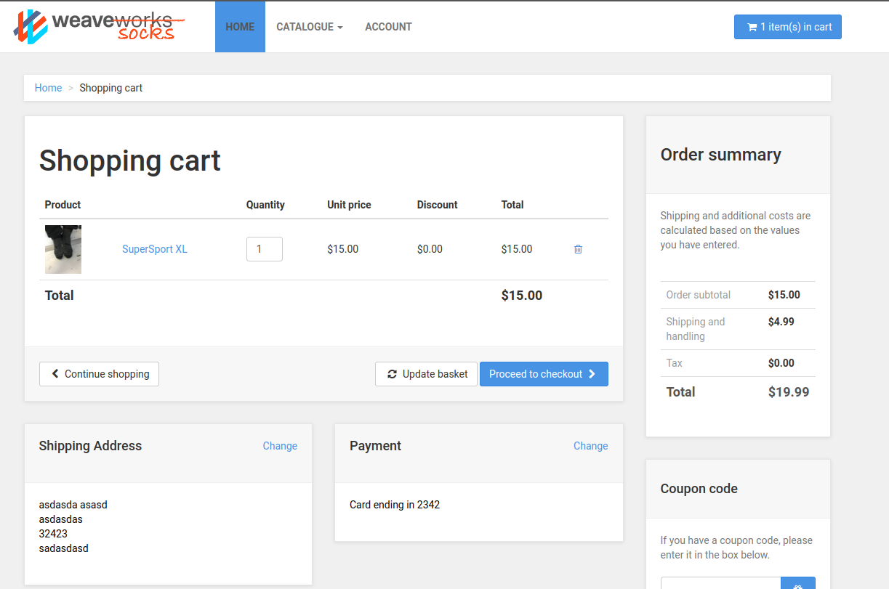

# Trabajo practico 4 - Arquitectura de Microservicios

## Desarrollo

En este trabajo practico se desarrollara una pequena arquitectura absada en **Microservicios**.

Una arquitectura de microservicios consta de una **colección de servicios autónomos y pequeños** Los servicios son independientes entre sí y cada uno debe implementar una funcionalidad de negocio individual.

Luego de clonar el repositorio indicado y correr docker-compose, accedemos a http://localhost/ y tenemos nuestra pagina web con arquitectura de microservicios

```
git clone https://github.com/microservices-demo/microservices-demo.git
docker-compose -f deploy/docker-compose/docker-compose.yml up -d
```


Creamos un usuario, agregamos datos de compra y simulamos la compra de un articulo




### Componentes y contenedores

Los contenedores creados son los siguientes:

- ```front-end```: Invoca a los otrso servicios a traves de API.
- ```edge-router```: Funciona como punto de acceso al sistema
- ```catalogue & catalogue-db```: servicios encargados de proveer informacion sobre el catalogo y gestionar su database.
- ```carts $ carts-db```: servicios encargados de informar sobre el carrito y gestionar su db
- ```orders & order-db```: servicios encargados de informar sobre las ordenes creadas por el usuario y gestionar su db
- ```shipping```: Servicio de compra y productor de mensajes
- ```queue-master```: Procesa las compras de shipping y consume mensajes.
- ```rabbitmq```: Intermediario entre queue-master y shipping, almacena mensajes.
- ```payment```: microservicio encargado de gestionar el pago
- ```user & user-db```: Servicio de cuentas de usuario, almacena tarjetas y direcciones.
- ```user-sim```: simulacion del uso real de la aplicacion (usuario dummy)

### Por que utilizamos repositorios separados?

Esto provoca una sub-division de nuestra aplicacion en modulos, creando limites mejor definidos y proporcionando una funcion unica a cada componente. Puede dificultar la conexion y comunicacion de los mismos, pero con una correcta documentacion y conocimiento del entorno resuelve muchso problemas de evolucion y desarrollo independiente de cada modulo.

### Ejercicios varios

- El contenedor `docker-compose_front-end_1` es el encargado de API gateway

- Ejecutando `curl http://localhost/customers` 

```
{
 "_embedded": {
  "customer": [
   {
    "firstName": "Eve",
    "lastName": "Berger",
    "username": "Eve_Berger",
    "id": "57a98d98e4b00679b4a830af",
    "_links": {
     "addresses": {
      "href": "http://user/customers/57a98d98e4b00679b4a830af/addresses"
     },
     "cards": {
      "href": "http://user/customers/57a98d98e4b00679b4a830af/cards"
     },
     "customer": {
      "href": "http://user/customers/57a98d98e4b00679b4a830af"
     },
     "self": {
      "href": "http://user/customers/57a98d98e4b00679b4a830af"
     }
    }
   },
   {
    "firstName": "User",
    "lastName": "Name",
    "username": "user",
    "id": "57a98d98e4b00679b4a830b2",
    "_links": {
     "addresses": {
      "href": "http://user/customers/57a98d98e4b00679b4a830b2/addresses"
     },
     "cards": {
      "href": "http://user/customers/57a98d98e4b00679b4a830b2/cards"
     },
     "customer": {
      "href": "http://user/customers/57a98d98e4b00679b4a830b2"
     },
     "self": {
      "href": "http://user/customers/57a98d98e4b00679b4a830b2"
     }
    }
   },
   {
    "firstName": "User1",
    "lastName": "Name1",
    "username": "user1",
    "id": "57a98d98e4b00679b4a830b5",
    "_links": {
     "addresses": {
      "href": "http://user/customers/57a98d98e4b00679b4a830b5/addresses"
     },
     "cards": {
      "href": "http://user/customers/57a98d98e4b00679b4a830b5/cards"
     },
     "customer": {
      "href": "http://user/customers/57a98d98e4b00679b4a830b5"
     },
     "self": {
      "href": "http://user/customers/57a98d98e4b00679b4a830b5"
     }
    }
   }
  ]
 }
}
```

Esta operacion esta siendo procesada por `docker-compose_user_1`

Para los casos 

```
curl http://localhost/catalogue
curl http://localhost/tags
```

los procesa `docker-compose_catalogue-1`

- Los datos persisten a traves de las 3 bases de datos mencionadas anteriormente: user, catalogue y order. Es importante destacar que tienen espacios de memoria temporales, y al dar de baja los contenedores perdemos la informacion.

- El componente encargado de procesar la cola de mensajes es `docker-compose_queue-master_1`

- Los microservicios utilizan interfaces de tipo RESTful, utilizando XML, texto o JSON para comunicarse.