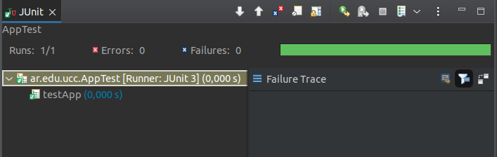

# Trabajo practico 5 - Herramientas de Construccion de Software

## Desarrollo

En primer lugar, configraumos todas las las variables de entorno necesarias luego de instalar JDK y Maven. A continuacion, una explicacion mas detallada sobre el ultimo.


## MAVEN

### 1. Qué es Maven?

Apache Maven es una herramienta de codigo abierto y gratuita, enfocada a la gestion de proyectos. Es utilizado principalmente para:

- Gestion de dependencias
- Herramienta de Compilacion
- Herramienta de Documentacion

El objetivo principal de Maven es permitir que un desarrollador comprenda el estado completo de un esfuerzo de desarrollo en el menor tiempo posible. Para lograr este objetivo, Maven se ocupa de varias áreas de preocupación:

- Facilitando el proceso de construcción
- Proporcionar un sistema de construcción uniforme
- Proporcionar información de proyectos de calidad.
- Fomentar mejores prácticas de desarrollo


### 2. Qué es el archivo POM?

POM hace referncia a "Project Object Model" (modelo de objetos del proyecto). Es una representación XML de un proyecto Maven contenido en un archivo llamado ``pom.xml``. 

El POM contiene toda la información necesaria sobre un proyecto, así como configuraciones de complementos que se utilizarán durante el proceso de construcción. Es una ventanilla única para todo lo relacionado con el proyecto. De hecho, en el mundo de Maven, un proyecto no necesita contener ningún código, simplemente un archivo ```pom.xml```.


```
<proyecto xmlns = "http://maven.apache.org/POM/4.0.0" xmlns:xsi = "http://www.w3.org/2001/XMLSchema-instance"  
  xsi:schemaLocation = "http://maven.apache.org/POM/4.0.0 https://maven.apache.org/xsd/maven-4.0.0.xsd" >
  <versión del modelo> 4.0.0 </versión del modelo>
 
  <groupId> org.codehaus.mojo </groupId>
  <artifactId> mi-proyecto </artifactId>
  <versión> 1.0 </versión>
</proyecto>
```
POM minimo indispensable permitido por MAVEN.

- modelVersion - contiene la version del modelo del POM

- groupId - Define el dominio, el proyecto real al que pertenece el proyecto MAVEN actual, suele ser unico por organizacion/proyecto. Cada ```artifact``` tiene un ```groupID```

- artifactId - Define un modulo MAVEN. Un artifact puede ser un JAR. Salida generada despues de construir un proyecto MAVEN.

- versionId - especifica la version del artifactId

### Repositorios locales, centrales y remotos

Un **repositorio** en MAVEN contiene artefactos de compilación y dependencias de diferentes tipos.

Existen 2 tipos de repositorios:

- **Locales** : el repositorio local es un directorio en la computadora donde se ejecuta Maven. Almacena en caché las descargas remotas y contiene artefactos de compilación temporales que aún no ha publicado.

- **Remotos** : Los repositorios remotos se refieren a cualquier otro tipo de repositorio, al que se accede mediante una variedad de protocolos como ```file://``` y ```https://```. Pueden ser un repositorio verdaderamente remoto configurado por un tercero para proporcionar sus artefactos para descargar (por ejemplo, repo.maven.apache.org) o pueden ser repositorios internos configurados en un servidor de archivos o HTTP dentro de su empresa.

### Ciclos de vida de BUILD

Hay tres ciclos de vida de compilación integrados: ```default```, ``clean`` y ``site``. El ciclo de vida DEFAULT maneja la implementación de un proyecto, el ciclo de vida CLEAN maneja la limpieza del proyecto, mientras que el ciclo de vida SITE maneja la creación del sitio web de su proyecto.

### Ejemplo de construccion de MVN 

Creamos a un archivo pom.xml lo siguiente:

```
<project xmlns="http://maven.apache.org/POM/4.0.0"
         xmlns:xsi="http://www.w3.org/2001/XMLSchema-instance"
         xsi:schemaLocation="http://maven.apache.org/POM/4.0.0
                      http://maven.apache.org/xsd/maven-4.0.0.xsd">
    <modelVersion>4.0.0</modelVersion>

    <groupId>ar.edu.ucc</groupId>
    <artifactId>proyecto-01</artifactId>
    <version>0.1-SNAPSHOT</version>
</project>
```

y ejecutamos 

```
mvn clean install
```

Como ejecutamos *mvn ***CLEAN*** install*, la instalacion comienza desde un estado limpio.

Se instalan archivos jar desde el repositorio central y se crea el proyecto MAVEN (con su .jar ejecutable)

## Maven continuacion

```
-------------------------------------------------------
 T E S T S
-------------------------------------------------------
Running ar.edu.ucc.AppTest
Tests run: 1, Failures: 0, Errors: 0, Skipped: 0, Time elapsed: 0.006 sec

Results :

Tests run: 1, Failures: 0, Errors: 0, Skipped: 0

[INFO] 
[INFO] --- maven-jar-plugin:2.4:jar (default-jar) @ ejemplo ---
[INFO] Building jar: /home/juan/ucc/ing-sw-3-villarreal/ejercicio-5/MAVEN/maven-cont/ejemplo/target/ejemplo-1.0-SNAPSHOT.jar
[INFO] ------------------------------------------------------------------------
[INFO] BUILD SUCCESS
[INFO] ------------------------------------------------------------------------
[INFO] Total time:  4.076 s
[INFO] Finished at: 2022-09-08T16:04:21-03:00
[INFO] ------------------------------------------------------------------------
```
```
juan@juannet:~/ucc/ing-sw-3-villarreal/ejercicio-5/MAVEN/maven-cont/ejemplo$ java -cp target/ejemplo-1.0-SNAPSHOT.jar ar.edu.ucc.App
Hello World!
```


## Manejo de dependencias

Una vez creado nuestro proyecto, cuando compilamos obtenemos el siguiente error:

```
[INFO] BUILD FAILURE
[INFO] ------------------------------------------------------------------------
[INFO] Total time:  0.835 s
[INFO] Finished at: 2022-09-08T16:20:59-03:00
[INFO] ------------------------------------------------------------------------
[ERROR] Failed to execute goal org.apache.maven.plugins:maven-compiler-plugin:3.1:compile (default-compile) on project ejemplo-uber-jar: Compilation failure: Compilation failure: 
[ERROR] Source option 5 is no longer supported. Use 6 or later.
[ERROR] Target option 1.5 is no longer supported. Use 1.6 or later.
[ERROR] -> [Help 1]
```

Por lo tanto, debemos agregar la dependencia necesaria

```
    <dependency>
      <groupId>ch.qos.logback</groupId>
      <artifactId>logback-classic</artifactId>
      <version>1.2.1</version>
    </dependency>
```

Volvemos a ejecutar nuestro jar, pero obtenemos lo siguiente

```
juan@juannet:~/ucc/ing-sw-3-villarreal/ejercicio-5/MAVEN/maven-dependencias/ejemplo-uber-jar$ java -cp target/ejemplo-uber-jar-1.0-SNAPSHOT.jar ar.edu.ucc.App
Exception in thread "main" java.lang.NoClassDefFoundError: org/slf4j/LoggerFactory
        at ar.edu.ucc.App.main(App.java:14)
Caused by: java.lang.ClassNotFoundException: org.slf4j.LoggerFactory
        at java.base/jdk.internal.loader.BuiltinClassLoader.loadClass(BuiltinClassLoader.java:581)
        at java.base/jdk.internal.loader.ClassLoaders$AppClassLoader.loadClass(ClassLoaders.java:178)
        at java.base/java.lang.ClassLoader.loadClass(ClassLoader.java:522)
        ... 1 more
```

Observamos que incluso luego de agregar dependencias en ```pom.xml``` no se encuentra una clase para importar (```java.lang.ClassNotFoundException: org.slf4j.LoggerFactory```). Como no obtenemos la dependencia en tiempo de ejecucion, es necesario entonces especificar el acceso a los archivos ```.jar``` necesarios.

Implementamos entonces la siguiente solucion

```
  <build>
    <plugins>
      <plugin>
        <groupId>org.apache.maven.plugins</groupId>
        <artifactId>maven-shade-plugin</artifactId>
        <version>2.0</version>
        <executions>
          <execution>
            <phase>package</phase>
            <goals>
              <goal>shade</goal>
            </goals>
            <configuration>
              <finalName>${project.artifactId}</finalName>
              <transformers>
                <transformer implementation="org.apache.maven.plugins.shade.resource.ManifestResourceTransformer">
                  <mainClass>ar.edu.ucc.App</mainClass>
                </transformer>
              </transformers>
              <minimizeJar>false</minimizeJar>
            </configuration>
          </execution>
        </executions>
      </plugin>
    </plugins>
  </build>
```

Obtenemos como salida

```
juan@juannet:~/ucc/ing-sw-3-villarreal/ejercicio-5/MAVEN/maven-dependencias/ejemplo-uber-jar$ java -jar target/ejemplo-uber-jar.jar
16:48:12.779 [main] INFO ar.edu.ucc.App - Hola Mundo!
```

### Utilizar un IDE

Importamos el proyecto en Eclipse


Corremos la app

```
17:49:10.428 [main] INFO ar.edu.ucc.App - Hola Mundo!
```
Testings



Configuracion de MAVEN


### Utilizando node-js

Instalamos el componente necesario para generar aplicaciones, creamos y ejecutamos la misma

```
npm install express-generator -g

juan@juannet:~/ucc/ing-sw-3-villarreal/ejercicio-5/hola-mundo$ npm start

> hola-mundo@0.0.0 start
> node ./bin/www

GET / 200 19.043 ms - 207
GET /stylesheets/style.css 200 6.540 ms - 111


```

Analizando **npm**, vemos que consiste de:

- Un repositorio online para publicar paquetes de software libre para ser utilizados en proyectos Node.js
- Una herramienta para la terminal (command line utility) para interactuar con dicho repositorio que te ayuda a la instalación de utilidades, manejo de dependencias y la publicación de paquetes

Este gran centro de paquetes esta disponible en https://npmjs.com 

Dentro de los archivos base, encontramos ```package.json```: indica a npm que el directorio en el que se encuentra es un proyecto npm y contiene la información del paquete incluyendo la descripción del mismo, versión, autor y más importante aún dependencias.

```
{
  "name": "hola-mundo",
  "version": "0.0.0",
  "private": true,
  "scripts": {
    "start": "node ./bin/www"
  },
  "dependencies": {
    "cookie-parser": "~1.4.4",
    "debug": "~2.6.9",
    "ejs": "~2.6.1",
    "express": "~4.16.1",
    "http-errors": "~1.6.3",
    "morgan": "~1.9.1"
  }
}

```


### Ejemplo con python