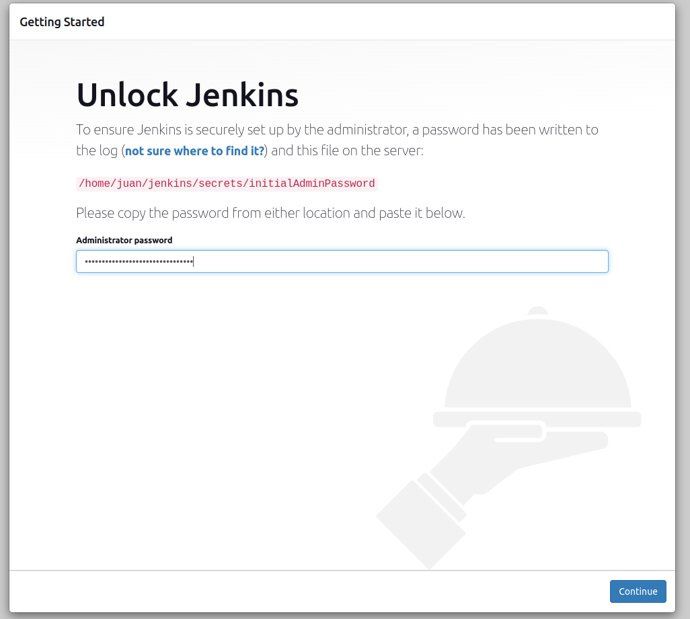
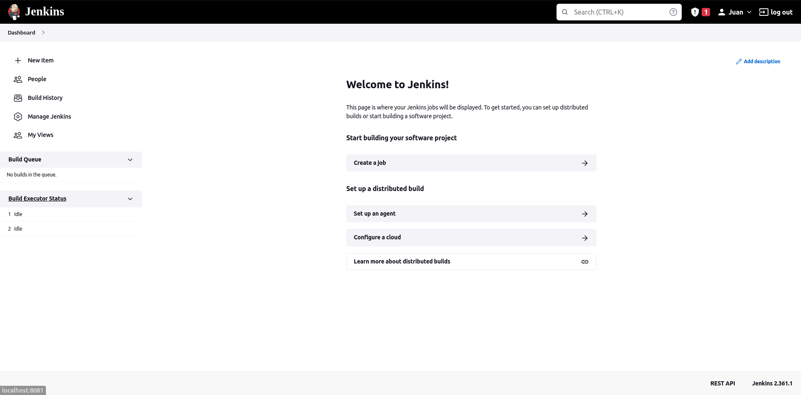
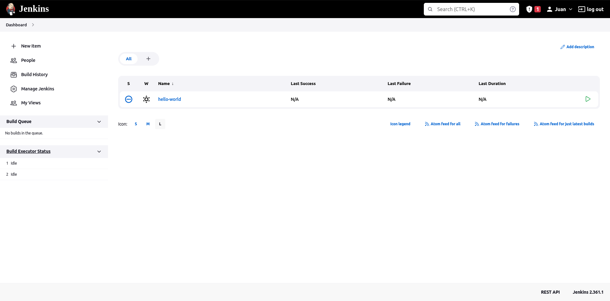
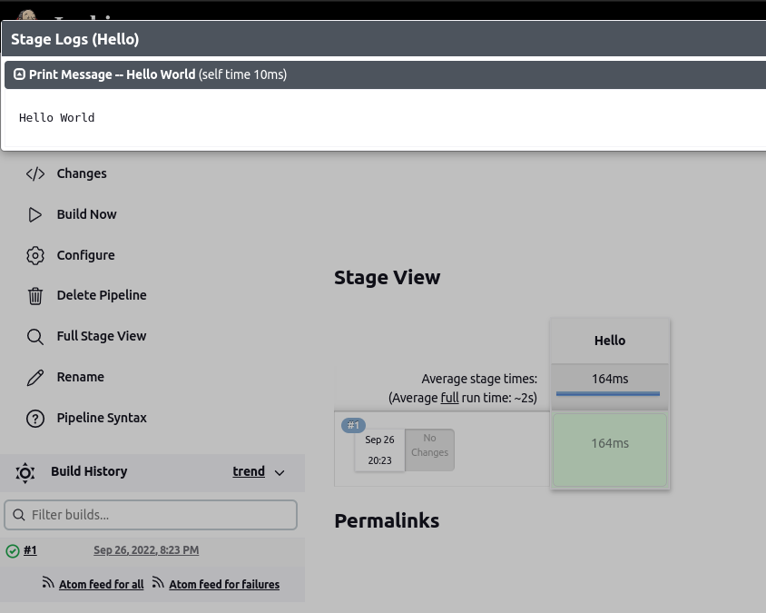
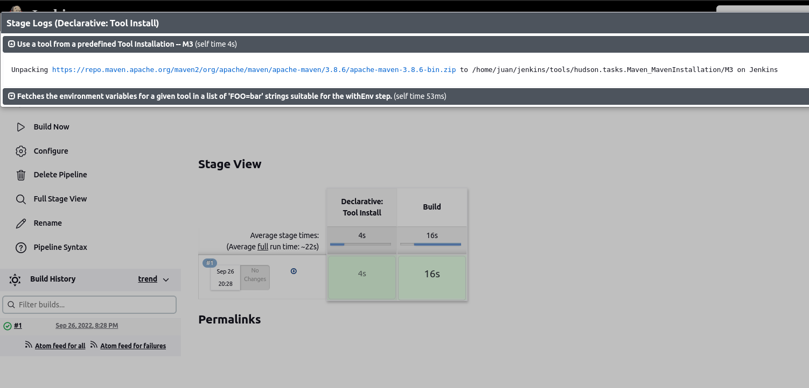
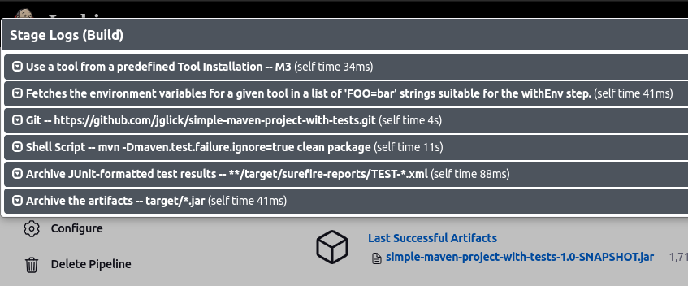
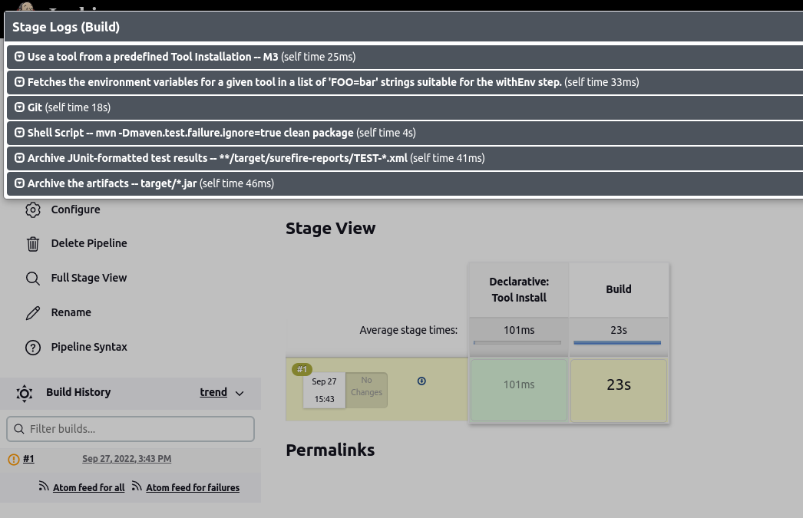
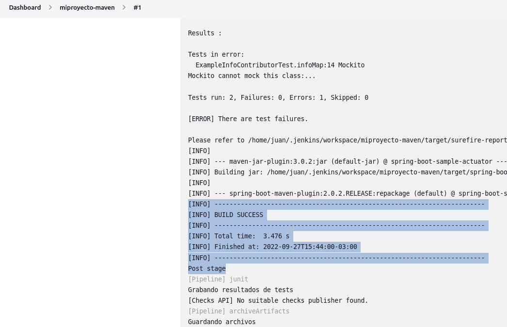
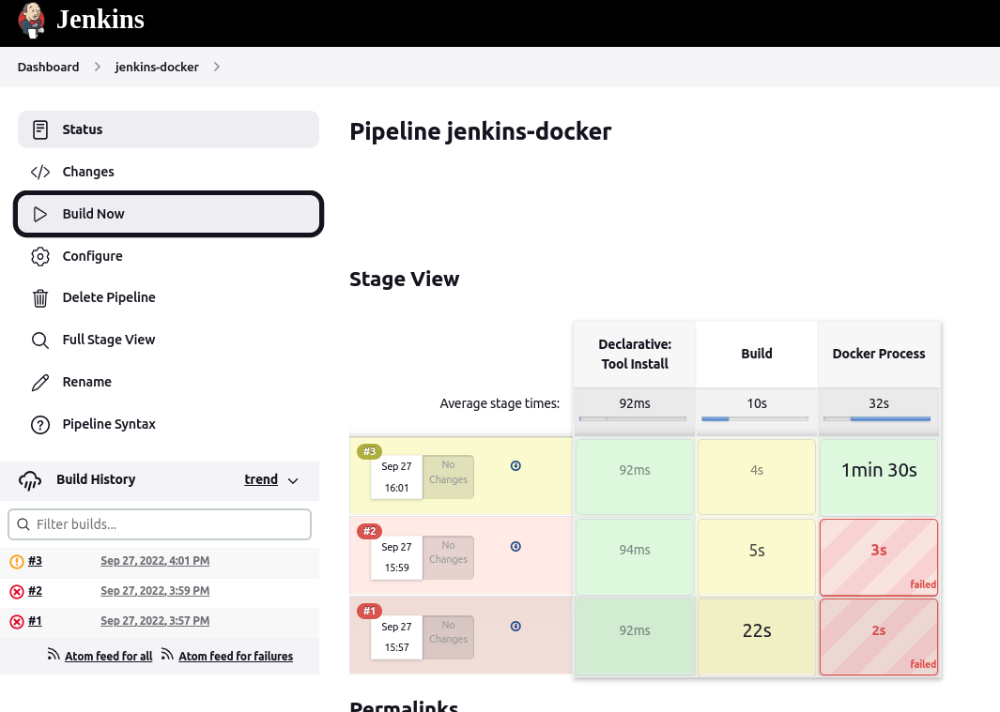
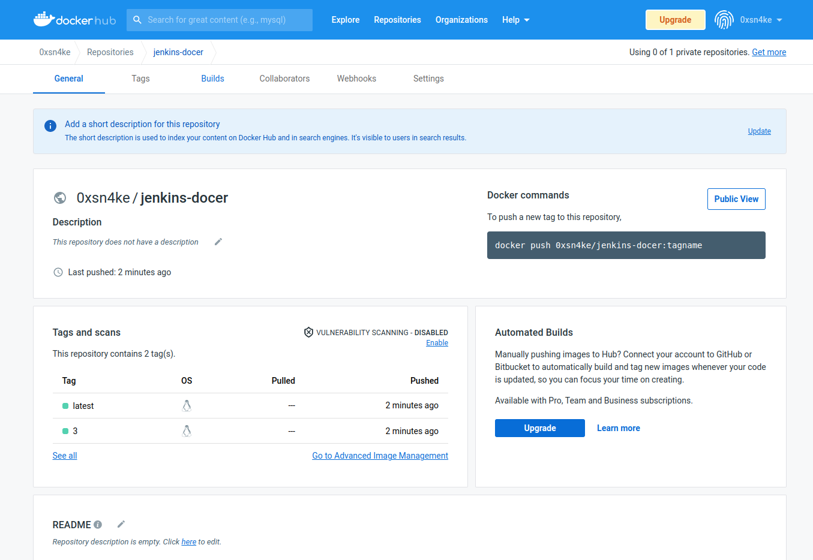

# Trabajo practico 7

## Servidor de Build (de integración continua)

Vamos a configurar e implementar herramientas de integración continua.

## Desarrollo

En primer lugar, ponemos en funcionamiento Jenkins

```
export JENKINS_HOME=~/jenkins

mkdir -p $JENKINS_HOME
cd $JENKINS_HOME

wget http://mirrors.jenkins.io/war-stable/latest/jenkins.war

java -jar jenkins.war --httpPort=8081
```



Creamos nuestro usuario (juan::juancito) y entramos a nuestro dashboard de Jenkins



Administramos plugins --> instalamos **Docker Pipeline** e instalamos

Configuracion de herramientas --> Agregamos maven con el nombre de M3 y que se instale automáticamente.

## Primer pipeline Job

Creamos un nuevo item de tipo **pipeline** con nombre *hello-world*, seleccionamos try sample Pipeline y luego Hello World. Guardamos y ejecutamos el Job





Obtenemos logs sobre la build, nos informa el tiempo que tardo en construirse (build) en ms y que fue exitoso.


## Pipeline Job con Git y Maven

Creamos un item *simple-maven* y ejecutamos el job git + maven



El script del modelo de pipeline git+maven es el siguiente:

```
pipeline {
    agent any

    tools {
        // Install the Maven version configured as "M3" and add it to the path.
        maven "M3"
    }

    stages {
        stage('Build') {
            steps {
                // Get some code from a GitHub repository
                git 'https://github.com/jglick/simple-maven-project-with-tests.git'

                // Run Maven on a Unix agent.
                sh "mvn -Dmaven.test.failure.ignore=true clean package"

                // To run Maven on a Windows agent, use
                // bat "mvn -Dmaven.test.failure.ignore=true clean package"
            }

            post {
                // If Maven was able to run the tests, even if some of the test
                // failed, record the test results and archive the jar file.
                success {
                    junit '**/target/surefire-reports/TEST-*.xml'
                    archiveArtifacts 'target/*.jar'
                }
            }
        }
    }
}
```

En primer lugar, anadimos al path la version de Maven configurada como M3. Luego en build, descarga un proyecto de Maven que solo tiene algunas fallas de prueba (y omisiones) al azar, para demostrar el informe de resultados. Ejecuta clean package.

Si Maven pudo ejecutar las pruebas, incluso si algunas fallaron, registra los resultados de la prueba y guarda en el archivo jar.

Analizando los logs de *build* podemos ver el paso a paso



## Utilizar nuestros proyectos

Creamos un repositorio con nuestro *spring-boot* del tp 6: https://github.com/ju4ncito/springboot-tp7


Modificamos el pipeline utilizado en git + maven para que utilice nuestro repositorio:
```
pipeline {
    agent any

    tools {
        // Install the Maven version configured as "M3" and add it to the path.
        maven "M3"
    }

    stages {
        stage('Build') {
            steps {
                // Get some code from a GitHub repository
                git branch: "main", url: 'https://github.com/ju4ncito/springboot-tp7'

                // Run Maven on a Unix agent.
                sh "mvn -Dmaven.test.failure.ignore=true clean package"

                // To run Maven on a Windows agent, use
                // bat "mvn -Dmaven.test.failure.ignore=true clean package"
            }

            post {
                // If Maven was able to run the tests, even if some of the test
                // failed, record the test results and archive the jar file.
                success {
                    junit '**/target/surefire-reports/TEST-*.xml'
                    archiveArtifacts 'target/*.jar'
                }
            }
        }
    }
}
```

y obtenemos






## Utilizar proyectos con Docker

Creamos nuestras credenciales para dockerhub en Jenkins, bajo el nombre de *docker-credentials*. Creamos un nuevo pipeline llamado jenkins-docker, con el siguiente script:

```
pipeline {
    agent any
    
    tools {
        // Install the Maven version configured as "M3" and add it to the path.
        maven "M3"
    }

    stages {
        stage('Build') {
            steps {
                // Get some code from a GitHub repository
                git branch: "main", url: 'https://github.com/ju4ncito/springboot-tp7'


                // Run Maven on a Unix agent.
                sh "mvn -Dmaven.test.failure.ignore=true clean package"

                // To run Maven on a Windows agent, use
                // bat "mvn -Dmaven.test.failure.ignore=true clean package"
            }

            post {
                // If Maven was able to run the tests, even if some of the test
                // failed, record the test results and archive the jar file.
                success {
                    junit '**/target/surefire-reports/TEST-*.xml'
                    archiveArtifacts 'target/*.jar'
                }
            }
        }
        
        stage('Docker Process') {
            steps{
                script{
                    def image = docker.build "0xsn4ke/jenkins-docer"
                    docker.withRegistry('https://registry.hub.docker.com', 'docker-credential') {
                        image.push("${env.BUILD_NUMBER}")
                        image.push("latest")
                    }
                }
            }
        }
    }
}
```

Corremos la build y obtenemos



Como nuestra build se construyo, podemos ver nuestra imagen en Dockerhub



