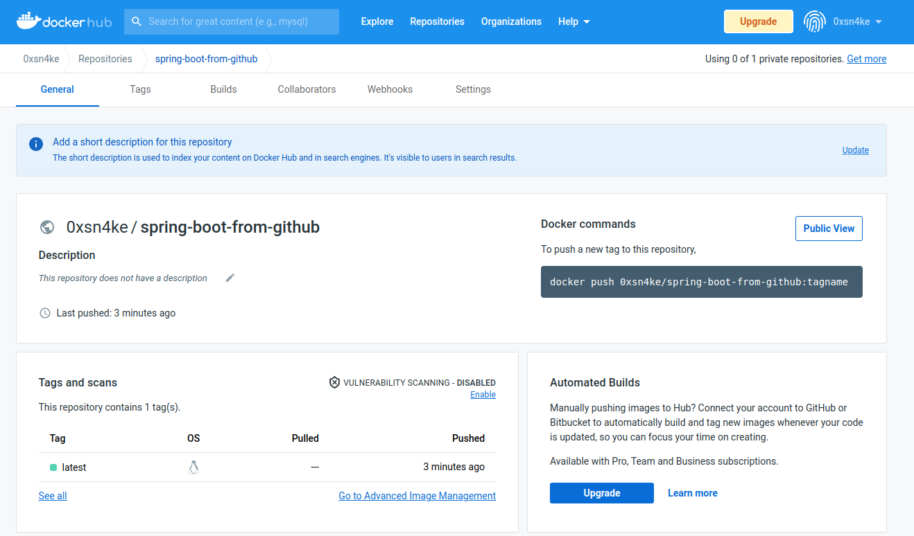

# Trabajo practico 8 

## Herramientas de construcción de software en la nube

Comparando con herramientas como Jenkins, que necesitan un servidor de mantenimiento continuo y con una buena configuracion, Github Actions proporciona corredores gratuitos que se pueden usar para realizar operaciones de CI/CD. Estos corredores son propiedad y están mantenidos por Github, pero también se pueden agregar corredores autohospedados. 

Una desventaja de usar Github Actions podria ser el estar atado a Github como sistema de gestión de código. El uso de Jenkins permite almacenar código en cualquier repositorio: en Github, Gitlab, BitBucket, etc.

### Configurando GitHub Actions

En primer lugar, nos dirigimos a nuestro repositorio con *spring* que utilizamos en el ejercicio anterior

https://github.com/ju4ncito/springboot-tp7

creamos un nuevo workflow


Definimos nuestro file 

```
# This is a basic workflow to help you get started with Actions

name: CI

# Controls when the workflow will run
on:
  # Triggers the workflow on push or pull request events but only for the master branch
  push:
    paths:
    - './**'
    branches: [ main ]
  pull_request:
    paths:
    - './**'  
    branches: [ main ]

  # Allows you to run this workflow manually from the Actions tab
  workflow_dispatch:

# A workflow run is made up of one or more jobs that can run sequentially or in parallel
jobs:
  # This workflow contains a single job called "build"
  build:
    # The type of runner that the job will run on
    runs-on: ubuntu-latest

    # Steps represent a sequence of tasks that will be executed as part of the job
    steps:
      # Checks-out your repository under $GITHUB_WORKSPACE, so your job can access it
      - uses: actions/checkout@v2

      # Install Java JDK with maven
      - name: Set up JDK 8
        uses: actions/setup-java@v2
        with:
          java-version: '8'
          distribution: 'adopt'
          cache: maven
          
      # Compile the application
      - name: Build with Maven
        run: |
          mvn -B package --file pom.xml
```

Este pipeline indica que se realiza un checkout ' actions/checkout@v2 ', se configura el JDK, y luego corre el comando establecido para construir el proyecto con Maven.


Repetimos el ejercicio 7 del trabajo práctico trabajo práctico 7, pero utilizando GitHub Actions. Utilizamos las siguientes indicaciones para los jobs, y configuramos los secretos dentro de nuestro proyecto (usuario y password de dockerhub):

```
name: Docker

on:
  workflow_dispatch:
  push:
    branches: [ $default-branch ]
    # Publish semver tags as releases.
    tags: [ 'v*.*.*' ]
  pull_request:
    branches: [ $default-branch ]

env:
  # Use docker.io for Docker Hub if empty
  REGISTRY: ghcr.io
  # github.repository as <account>/<repo>
  IMAGE_NAME: ${{ github.repository }}


jobs:
  build:

    runs-on: ubuntu-latest
    permissions:
      contents: read
      packages: write
      # This is used to complete the identity challenge
      # with sigstore/fulcio when running outside of PRs.
      id-token: write

    steps:
      - name: Checkout repository
        uses: actions/checkout@v3

      # Workaround: https://github.com/docker/build-push-action/issues/461
      - name: Setup Docker buildx
        uses: docker/setup-buildx-action@79abd3f86f79a9d68a23c75a09a9a85889262adf

      # Login against a Docker hub
      - name: Log into docker hub
        if: github.event_name != 'pull_request'
        uses: docker/login-action@v2
        with:
          username: ${{ secrets.DOCKER_USER }}
          password: ${{ secrets.DOCKER_PSW }}


      # Build and push Docker image with Buildx (don't push on PR)
      # https://github.com/docker/build-push-action
      - name: Build and push Docker image
        id: build-and-push
        uses: docker/build-push-action@v2
        with:
          context: .
          push: ${{ github.event_name != 'pull_request' }}
          tags: 0xsn4ke/spring-boot-from-github:latest 

      # Sign the resulting Docker image digest except on PRs.
      # This will only write to the public Rekor transparency log when the Docker
      # repository is public to avoid leaking data.  If you would like to publish
      # transparency data even for private images, pass --force to cosign below.
      # https://github.com/sigstore/cosign
      - name: Sign the published Docker image
        if: ${{ github.event_name != 'pull_request' }}
        env:
          COSIGN_EXPERIMENTAL: "true"
        # This step uses the identity token to provision an ephemeral certificate
        # against the sigstore community Fulcio instance.
        run: echo "${{ steps.meta.outputs.tags }}" | xargs -I {} cosign sign {}@${{ steps.build-and-push.outputs.digest }}
```





Tenemos ahora nuestra imagen publicada en dockerhub.