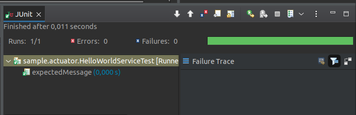
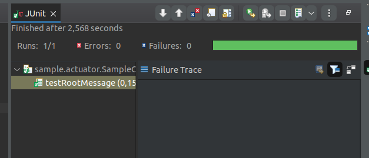
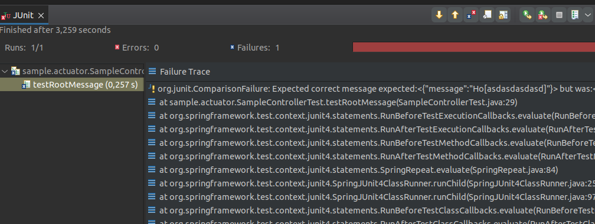
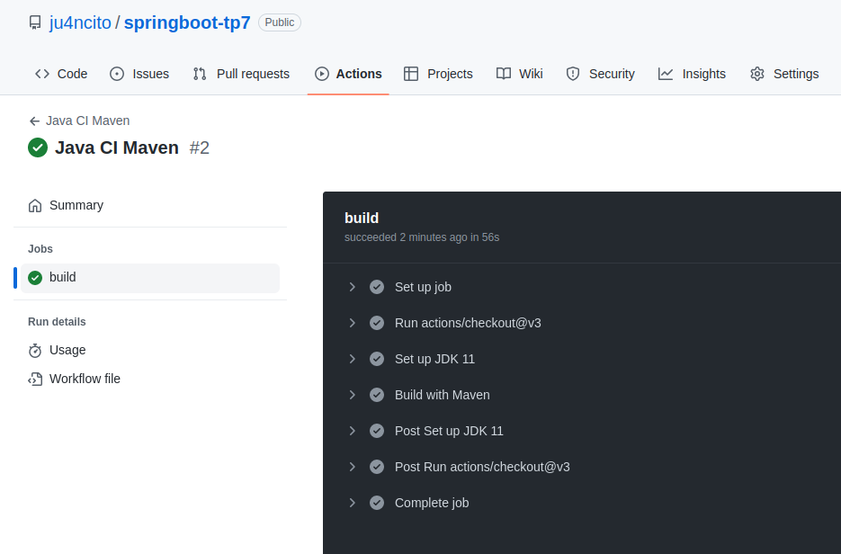

# Trabajo practico 9

## Pruebas de unidad

Una prueba de software es una pieza de software que ejecuta otra pieza de software. Valida si ese código da como resultado el estado esperado (prueba de estado) o ejecuta la secuencia de eventos esperados (prueba de comportamiento). Las pruebas de la unidad de software ayudan al desarrollador a verificar que la lógica de una parte del programa sea correcta.

### Utilizando unit testing

La dependencia

```
		<dependency>
			<groupId>org.springframework.boot</groupId>
			<artifactId>spring-boot-starter-test</artifactId>
			<scope>test</scope>
		</dependency>
```

hace lo siguiente: --

Ejecutamos el UNIT TEST: `Hello-World-Service-Test` y obtenemos:



### Mockito

El objetivo principal de usar Mockito es simplificar el desarrollo de una prueba al eliminar el hecho de depender de las dependencias externas y usarlas en el código de prueba. Como resultado, proporciona un código de prueba más simple que es más fácil de leer, comprender y modificar.

### Primer mock

Agregamos un unit test a la clase `HelloWorldServiceTest` que:

- Cuando se llame por primera vez al método getHelloMessage retorne "Hola Hola"
- Cuando se llame por segunda vez al método getHelloMessage retorne "Hello Hello"

En `HelloWorldService` cambiamos a

```
package sample.actuator;

import static org.junit.Assert.assertEquals;

import org.junit.Test;

public class HelloWorldServiceTest {

	@Test
	public void expectedMessage() {
		HelloWorldService helloWorldService = new HelloWorldService();
		assertEquals("Hola hola",helloWorldService.getHelloMessage());
		assertEquals("Hello hello",helloWorldService.getHelloMessage());
	}

}
```

y en el TEST indicamos:

```
package sample.actuator;

import static org.junit.Assert.assertEquals;

import org.junit.Test;

public class HelloWorldServiceTest {

	@Test
	public void expectedMessage() {
		HelloWorldService helloWorldService = new HelloWorldService();
		assertEquals("Hola hola",helloWorldService.getHelloMessage());
		assertEquals("Hello hello",helloWorldService.getHelloMessage());
	}

}
```


Ahora corremos el test de SampleControllerTest, en donde indicamos el mensaje que tendria que arrojar (Hola Hola)

```
package sample.actuator;

import static org.junit.Assert.assertEquals;

import org.junit.Before;
import org.junit.Test;
import org.springframework.http.MediaType;
import org.springframework.test.web.servlet.MvcResult;
import org.springframework.test.web.servlet.request.MockMvcRequestBuilders;


public class SampleControllerTest extends AbstractTest {

    @Override
    @Before
    public void setUp() {
        super.setUp();
    }

    @Test
    public void testRootMessage() throws Exception {
        String uri = "/";
        MvcResult mvcResult = mvc.perform(MockMvcRequestBuilders.get(uri)
                .accept( MediaType.APPLICATION_JSON_VALUE)).andReturn();

        String content = mvcResult.getResponse().getContentAsString();
        int status = mvcResult.getResponse().getStatus();
        assertEquals(200, status);
        assertEquals("Expected correct message","{\"message\":\"Hola Hola\"}",content);
    }
}
```



El test corre y nos arroja que pasaron con exito. Modificamos para forzar el error



### Capturar los unit tests como parte del proceso de CI/CD

Corremos el proyecto a traves de Github actions


